# Village User Guide

Village helps a household coordinate children’s schedules, care requests, and handoffs with trusted caregivers. This guide covers the parent and caregiver experience in the iOS and Android app.

> The people and events shown below are fictional demo data. Your app only shows households and children you are permitted to access.

## 1. Get started

Open Village and choose **Get Started** to create an account, or **Sign In** if you already have one.

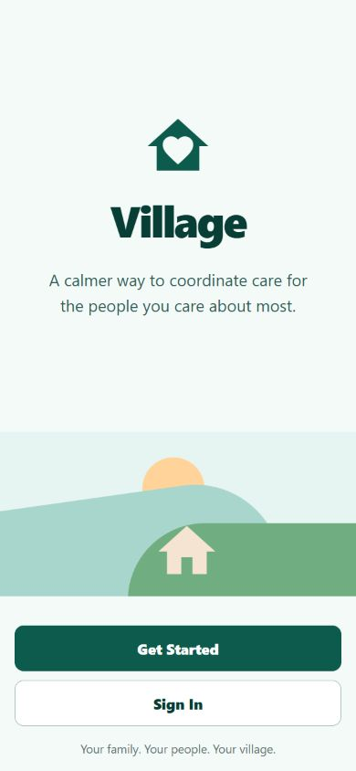

### Create an account

1. Enter the email address you want to use with Village.
2. Create a password with at least eight characters.
3. Tap **Create Account**.
4. Open the verification email from Village and follow its link.
5. Return to the app and sign in.

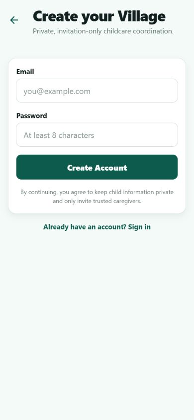

If you forget your password, tap **Forgot your password?** on the sign-in screen. Follow the emailed link, choose a new password, and return to Village.

### Set up your household

The first time you sign in, Village asks you to name your household, choose its timezone, and add your first child. The timezone keeps Today and Schedule accurate through travel and daylight-saving changes.

You can add more children and caregivers later. Push notifications are optional and can be enabled after onboarding; all important updates still appear in the app if you decline.

### Join an existing household

If a parent or household manager invited you:

1. Open the invitation link on the phone where Village is installed.
2. Sign in or create an account using the same email address that received the invitation.
3. Review the household, role, children, and permissions in the invitation.
4. Choose **Accept** to join or **Decline** to refuse access.

Invitation links are private, single-use, and expire. Ask the sender to resend an invitation if the link has expired or was already used.

## 2. Find your way around

The bottom navigation is available throughout the main app:

| Area         | What it is for                                                          |
| ------------ | ----------------------------------------------------------------------- |
| **Today**    | Current responsibility, upcoming care, open requests, and coverage gaps |
| **Schedule** | Today, Tomorrow, and This Week views of events                          |
| **+**        | Quick access to a help request, handoff, or new event                   |
| **Village**  | Trusted caregivers, permissions, and invitations                        |
| **Family**   | Child profiles, care notes, and upcoming schedules                      |

Tap the center **+** button when you need to act quickly.
On forms and detail screens, tap the back arrow beside the page title to return without completing an action.

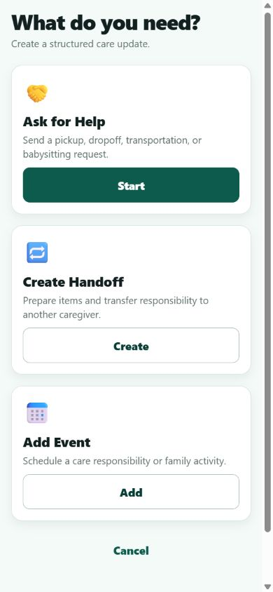

### View your account or sign out

Tap the account icon beside the notification bell on Today to review your profile, household, and timezone. **Sign Out** is at the bottom of the Account screen.

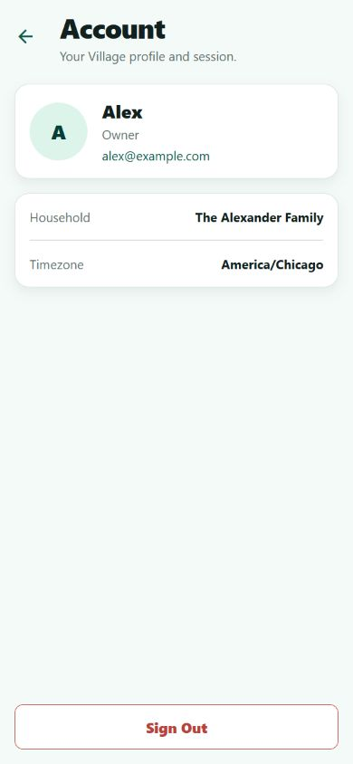

## 3. Use the Today dashboard

Today is the household’s compact coordination overview. It shows each child’s most recent acknowledgment with its date and time, the next available event on today’s schedule, and unresolved care responsibilities. Larger screens show additional items when space permits. Tap **See all** beside Today’s schedule to switch to Schedule, or beside **Needs attention** to expand all unresolved items.

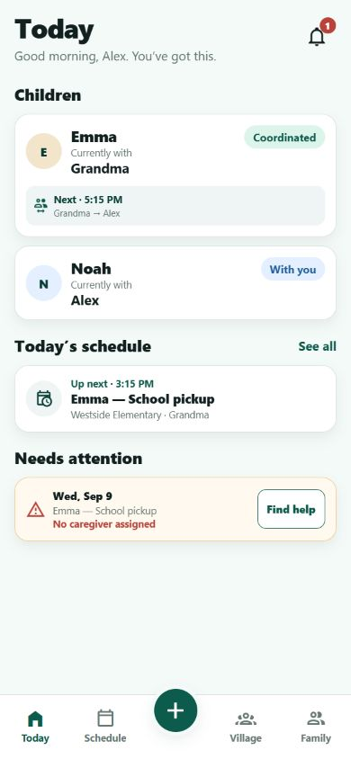

### Understand “Last acknowledged with”

**Last acknowledged with** names the caregiver in the latest completed handoff and shows when they acknowledged it. It is a historical coordination record, not proof of the child’s current location. Confirm directly with the caregiver whenever real-world circumstances are unclear.

### Handle a coverage gap

**Needs attention** includes unassigned events, open help requests, and overdue handoffs. An unassigned event stays visible after its start time until it is assigned, completed, or cancelled. Urgent items appear first. Tap **Find Help** to start a request with the event details filled in, or open an existing request to ask more caregivers. You can also edit the event from Schedule to assign a caregiver, mark care complete, or cancel it.

## 4. Manage the schedule

Open **Schedule** to switch between **Today**, **Tomorrow**, and **This Week**. Events appear in chronological order with the child, place, and assigned caregiver.

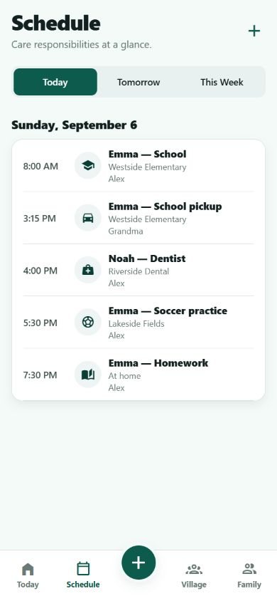

### Add an event

1. Tap **+** in the Schedule header, or choose **Add Event** from the center quick-actions button.
2. Select the child and event type.
3. Add a title, date and start time, location, and caregiver. Add an end time when the responsibility lasts for a period.
4. Save the event.

Dates and times use the household timezone shown on the form. Invalid dates and times are rejected. Times skipped by a daylight-saving change cannot be saved; when a clock change repeats a time, the form lets you choose the occurrence.

Tap an existing event to edit it, change the caregiver, mark it complete, or cancel it. Editing its time or location updates any active linked help request. Completing or cancelling the event also closes that request. The child cannot be changed while a linked request is active; cancel the request first. Completed request history is preserved.

## 5. Manage children

Open **Family** to see the children in the active household. Tap a child for profile details, or tap **+** to add another child.

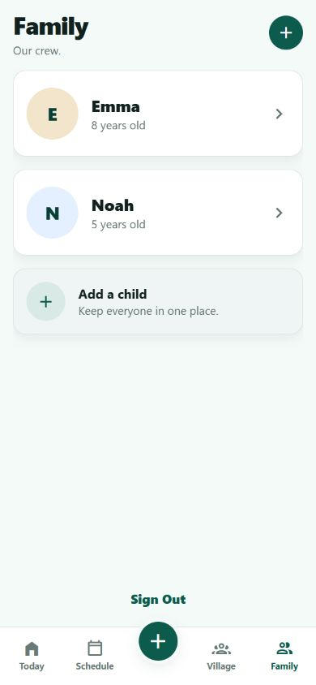

Each child profile includes basic information, care notes, the next handoff, and upcoming events. Only caregivers with permission for that child can see the profile.

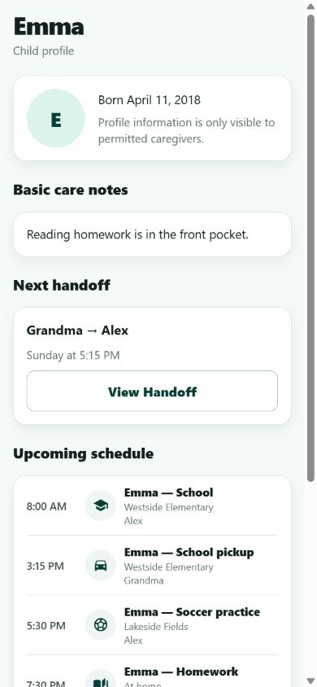

### Update a child profile

1. Open **Family** and select the child.
2. Tap **Edit Profile**.
3. Update the child’s name, birth date, avatar, or care notes. You can enter a birth date as `YYYYMMDD`; Village adds the hyphens when you leave the field.
4. Save your changes.

Use care notes for concise information a permitted caregiver needs. Avoid storing information that is not needed for care coordination.

### Archive a child

Archiving removes the child from active household workflows while preserving history. Review future events and handoffs first. Use archive when a profile should no longer be active; do not use it as a temporary visibility setting.

## 6. Manage your Village

Open **Village** to see trusted caregivers and their capabilities. Tap a member to review their relationship, availability, child access, and permission details. Household managers can edit access or remove a member.

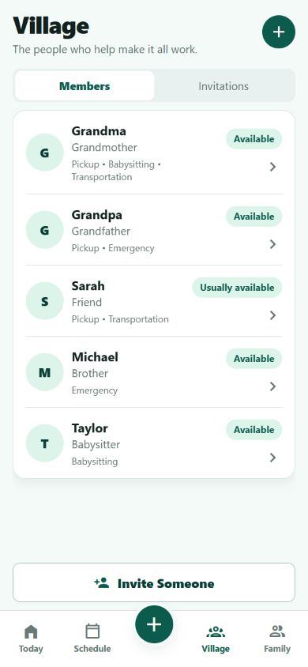

The **Invitations** tab shows pending invitations. From there, a manager can resend or revoke an invitation.

### Invite a caregiver

1. Tap the person-plus icon (**+**) in the Village header.
2. Enter the caregiver’s name and email address.
3. Choose an access preset:
   - **Parent / guardian** for broad household management.
   - **Trusted caregiver** for regular care coordination.
   - **Limited caregiver** for narrowly assigned responsibilities.
4. Select the children they may access.
5. Select what they can help with, such as pickup or babysitting.
6. Add their relationship to the family.
7. Tap **Send & Share Invitation**.

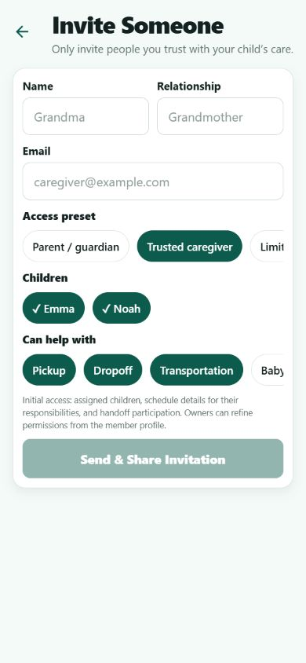

Village emails an opaque invitation link and also opens the phone’s share sheet. Share it only with the intended person. A caregiver’s access is always limited by their household role, selected children, and explicit permissions.

### Remove a member

Removing a member ends their access immediately. Village also unassigns their future events, cancels pending handoffs involving them, and flags resulting coverage gaps. Review the Today dashboard and Schedule after removal.

## 7. Ask your Village for help

Use a structured help request when an event needs a caregiver.

1. Tap **Find Help** on a coverage gap, or choose **Ask for Help** from the center **+** quick-actions button.
2. Choose the help type and child. Select **Other** when pickup, dropoff, babysitting, or transportation does not describe the request.
3. Choose the date, time, and location. For a request linked to an existing event, use **Edit Event Details** to change its schedule.
4. Select one or more eligible caregivers.
5. Add an optional care note.
6. Tap **Ask My Village** and confirm the summary.

Tap the back arrow beside **Ask for Help** to return without sending a request.

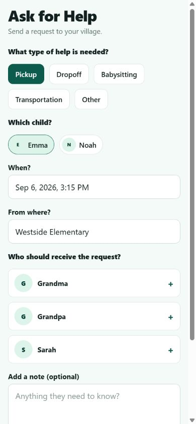

The request creates or links one schedule event. The first eligible caregiver to accept gets the assignment; Village updates the linked event and tells the parent and other recipients. This prevents two people from accepting the same responsibility.

Recipients can open the notification to review the child, time, location, and responsibility-specific notes, then **Accept** or **Decline**. A parent can cancel an open or covered request and mark covered care complete. To change the child or accepted caregiver, cancel the request and schedule the revised responsibility. Removing an assigned caregiver reopens their future requests for coverage.

If someone else accepts while your screen is stale, Village shows a conflict message and refreshes the latest assignment.

The request shows which caregivers are waiting to respond, accepted, or declined. Declining remains visible in the response history. When everyone declines, **Nobody available** makes clear that care still needs coverage. A parent or authorized request creator can select additional eligible caregivers and ask them on the same request. Village keeps one event and one assignment, and repeated submissions do not send duplicate invitations to those caregivers.

Older versions automatically marked unanswered recipients as declined when someone accepted. Those historical records cannot distinguish an actual decline from an automatic closure; new responses preserve that distinction.

## 8. Create and complete a handoff

A handoff records the transfer of care responsibility from one household member to another.

### Create a handoff

1. Tap the center **+** button and choose **Create Handoff**.
2. Choose the child, sender, and receiver.
3. Choose the date and time in the household timezone, and confirm the location.
4. Add checklist items and a short note.
5. Optionally connect the handoff to an upcoming event.
6. Tap **Create Handoff**.

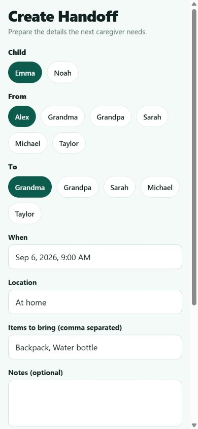

### Prepare and acknowledge the handoff

The sender checks the prepared items and taps **Mark as Ready**. The authorized receiver reviews the checklist and notes, then taps **I’ve Received [child]** when the real-world handoff occurs.

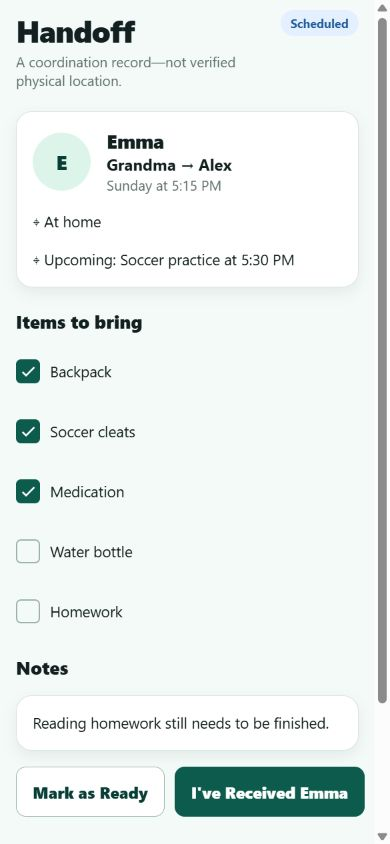

Acknowledgment records who received the child and when, transfers the app’s responsibility state, and completes the handoff in one step. Completed handoffs cannot be edited or reopened; create a new handoff to correct the coordination record.

An active handoff becomes **Overdue** after its scheduled time passes without acknowledgment. It remains in **Needs attention** until the handoff is completed or cancelled. The sender or a household manager can use **Cancel Handoff** if the planned transfer will not happen; cancellation does not transfer responsibility or change the last acknowledgment. Confirm directly with the caregiver; an overdue record does not establish where the child is.

## 9. Use notifications

Tap the bell on Today to open in-app notifications. An unread count appears on the bell. Tap a notification to open the related invitation, help request, assignment, or handoff when an action is available.

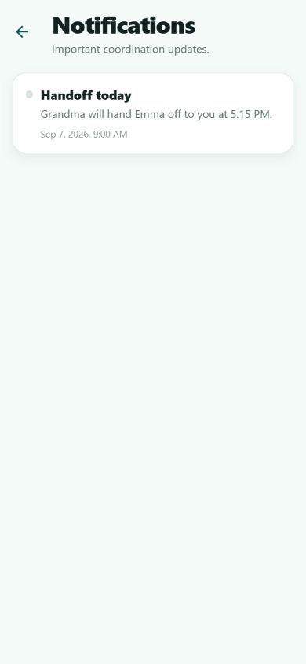

If you allow push notifications, Village can alert you when the app is closed. Turning push off does not remove in-app notifications. Do not include sensitive medical or personal information in text that may appear on a lock screen.

## 10. Offline, errors, and privacy

- Previously loaded information may remain visible while offline and will be marked stale. Creating or changing records requires a connection.
- Pull down on a main screen to refresh after reconnecting.
- If an action fails, use **Retry**. Before repeating a time-sensitive action, check whether another caregiver already accepted it.
- A **Permission denied** message means your role, child access, or assignment does not allow that action. Ask a household manager to review your access.
- Village stores timestamps in UTC and displays them in the household timezone.
- Private avatars and household records are limited to authorized members. Assignment-only access reveals only the details needed for that responsibility.

## 11. Quick troubleshooting

### I cannot accept an invitation

Confirm you signed in with the invited email address. If the link is expired, revoked, or already used, ask the sender to create or resend an invitation.

### I do not see a child or event

Pull to refresh, then ask a household manager to check your child permissions and assignment. You may only see the children and responsibilities shared with you.

### A handoff button is unavailable

Only the designated sender can mark a handoff ready, and only the designated receiver can acknowledge receipt. Cancelled and completed handoffs cannot be changed.

### Notifications are not appearing

Check the in-app bell first. For push alerts, enable notifications for Village in the phone’s system settings and reopen the app so it can register the device.

### I still need help

Record what you were trying to do, the approximate time, and the message shown. Do not send invitation tokens, passwords, or sensitive care notes in a support request.
